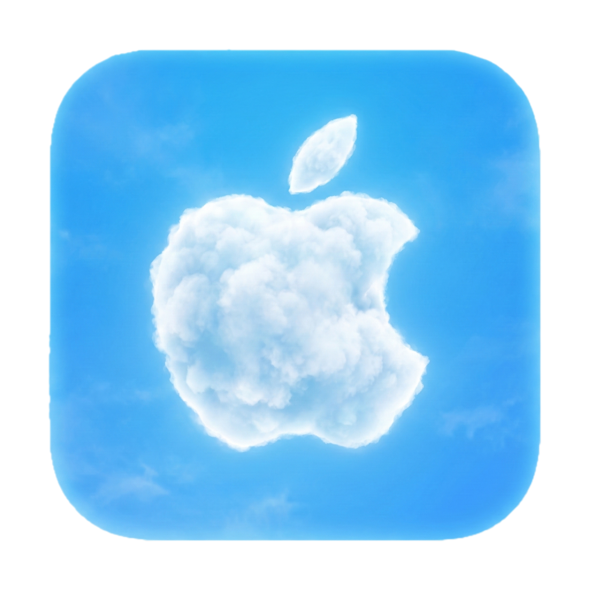

# iCloud-Sync

<p align="center">
  
</p>

A lightweight macOS menu bar app and background daemon that keeps local folders in sync with iCloud Drive — built for people who **cannot use Apple's native iCloud Drive integration**.

## Why this exists

If your Mac is enrolled in a corporate Mobile Device Management (MDM) profile, your company may restrict or completely block the native iCloud Drive client. This is common in enterprise environments where IT policies prevent personal cloud storage from running as a system service.

iCloud-Sync works around this by talking directly to iCloud's API (via [pyicloud](https://github.com/timlaing/pyicloud)) from user space — no system extensions, no privileged daemons, no interaction with the macOS iCloud subsystem that MDM profiles lock down. It runs entirely as an unprivileged background process and communicates with iCloud over HTTPS, the same way a web browser would.

## Features

- **Menu bar app** — start/stop the daemon, manage sync pairs, and configure settings from the macOS status bar
- **Multi-folder sync** — sync as many iCloud Drive ↔ local folder pairs as you need
- **Native dialogs** — setup, authentication, and 2FA all use standard macOS system dialogs (no terminal required)
- **Automatic reload** — adding or removing a sync pair takes effect immediately without restarting the daemon
- **Start at login** — optional LaunchAgent installs automatically from the Settings dialog
- **Conflict handling** — last-write-wins; the losing version is preserved as `.conflict-TIMESTAMP.ext`

## How it works

- **Local changes** are detected instantly via `watchdog` (filesystem events)
- **Remote changes** are detected by polling iCloud Drive every 60 seconds (iCloud has no push API)
- **Session** is kept alive with periodic refresh; Apple sessions last ~2 months

## Requirements

**To run the app:** macOS 13+. No Python installation required — the `.app` bundle includes its own.

**To build from source:** macOS 13+, Python 3.11+, Xcode command-line tools.

## Installation

### 1. Clone and install

```bash
git clone https://github.com/madchicken/icloud-sync.git
cd icloud-sync
python -m venv .venv
.venv/bin/pip install -e .
```

### 2. Build the .app bundle

Generate the icon and build the app:

```bash
.venv/bin/python scripts/make_icon.py
bash scripts/build_app.sh
```

This produces `dist/iCloud Sync.app`.

### 3. Install the app

```bash
cp -r "dist/iCloud Sync.app" /Applications/
```

On first launch, right-click the app → **Open** to approve it (required for unsigned apps). Alternatively:

```bash
sudo spctl --add "/Applications/iCloud Sync.app"
```

### 4. Sign in

Click the cloud icon in the menu bar → **Setup / Credentials…**

The setup wizard will ask for your Apple ID, password, and 2FA code using native macOS dialogs. Credentials are stored securely in the macOS Keychain.

## Menu bar usage

| Menu item | Description |
|---|---|
| **Start / Stop** | Start or stop the sync daemon |
| **Sync Pairs** | See all configured sync pairs |
| **Pairings…** | Add or remove iCloud ↔ local folder pairs |
| **Settings…** | Start at login, auto-start daemon, polling interval |
| **Setup / Credentials…** | Sign in or update your Apple ID credentials |
| **Open Log** | Open the sync log in Console |

## Sync behaviour

| Situation | Action |
|---|---|
| New file on remote | Download to local |
| New file on local | Upload to remote |
| Remote file newer than last sync | Download, overwrite local |
| Local file newer than last sync | Upload, overwrite remote |
| Both modified (conflict) | Last-write-wins; loser saved as `.conflict-TIMESTAMP.ext` |
| Deleted on remote | Delete local |
| Deleted on local | Delete remote |

Files never synced: `.DS_Store`, `*.tmp`, `*.part`, hidden files (`.`-prefixed), `desktop.ini`, `Thumbs.db`.

## Two-factor authentication

During initial setup, 2FA is handled via a native dialog — just enter the code that appears on your trusted Apple device.

When the session expires (~2 months), re-run **Setup / Credentials…** from the menu bar to refresh it.

## Project structure

```
icloud-sync/
├── icloud_sync/
│   ├── tray_app.py     — menu bar app (rumps)
│   ├── cli.py          — icloud-sync CLI entry point
│   ├── auth.py         — keychain helpers, authentication, 2FA handling
│   ├── config.py       — config, sync pairs, PID file, preferences
│   ├── state.py        — sync state persistence (JSON)
│   ├── engine.py       — reconciliation logic
│   ├── watcher.py      — local filesystem watcher (watchdog)
│   └── sync_daemon.py  — daemon main loop
├── scripts/
│   ├── make_icon.py    — generates AppIcon.icns and menu bar template image
│   ├── build_app.sh    — assembles and signs the .app bundle
│   └── launcher.c      — C binary launcher (required by Gatekeeper)
└── com.icloud.sync.plist  — launchd agent template (manual install)
```

## Limitations

- iCloud Drive has no push API — remote changes are detected by polling (default: every 60 seconds)
- Only top-level iCloud Drive folders can be selected as sync targets
- Does not sync shared folders or iCloud shared albums
- The `.app` bundle is macOS-only and must be built on macOS (no cross-compilation)

## License

MIT
